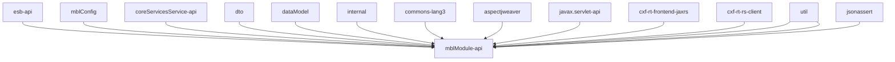

```sh
@startuml
esb_api -- mblModule_api
mblConfig -- mblModule_api
coreServicesService_api -- mblModule_api
dto -- mblModule_api
dataModel -- mblModule_api
internal -- mblModule_api
commons_lang3 -- mblModule_api
aspectjweaver -- mblModule_api
javax.servlet_api -- mblModule_api
cxf_rt_frontend_jaxrs -- mblModule_api
cxf_rt_rs_client -- mblModule_api
util -- mblModule_api
util -- mblModule_api
jsonassert -- mblModule_api
@enduml
```