```mermaid
 graph TD

mblService_server --> mblClient
mblService-api --> mblService-server
event-api --> mblService-server
util --> mblService-server
mblModule-api --> mblService-server
push-api --> mblService-server
fom-api --> mblService-server
util --> mblService-server
core --> mblService-server
context-api --> mblService-server
api --> mblService-server
dto --> mblService-server
apt-extension-api --> mblService-server
fom-rest-interface --> mblService-server
coreServicesService-api --> mblService-server
dataModel --> mblService-server
spring-context --> mblService-server
spring-web --> mblService-server
spring-security-core --> mblService-server
cxf-rt-frontend-jaxrs --> mblService-server
cxf-rt-rs-client --> mblService-server
json-simple --> mblService-server
aspectjweaver --> mblService-server
javax.servlet-api --> mblService-server
mblModule-impl --> mblService-server
util --> mblService-server
powermock-module-junit4-rule-agent --> mblService-server
powermock-module-junit4 --> mblService-server
powermock-api-mockito2 --> mblService-server
okhttp --> mblService-server
mockwebserver --> mblService-server
jsonassert --> mblService-server

```

```sh
@startuml
mblService_server -- mblClient
mblService_api -- mblService_server
event_api -- mblService_server
util -- mblService_server
mblModule_api -- mblService_server
push_api -- mblService_server
fom_api -- mblService_server
util -- mblService_server
core -- mblService_server
context_api -- mblService_server
api -- mblService_server
dto -- mblService_server
apt_extension_api -- mblService_server
fom_rest_interface -- mblService_server
coreServicesService_api -- mblService_server
dataModel -- mblService_server
spring_context -- mblService_server
spring_web -- mblService_server
spring_security_core -- mblService_server
cxf_rt_frontend_jaxrs -- mblService_server
cxf_rt_rs_client -- mblService_server
json_simple -- mblService_server
aspectjweaver -- mblService_server
javax.servlet_api -- mblService_server
mblModule_impl -- mblService_server
util -- mblService_server
powermock_module_junit4_rule_agent -- mblService_server
powermock_module_junit4 -- mblService_server
powermock_api_mockito2 -- mblService_server
okhttp -- mblService_server
mockwebserver -- mblService_server
jsonassert -- mblService_server
@enduml
```