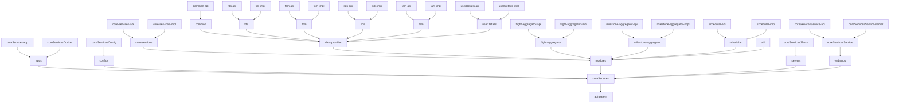

```mermaid
 graph TD
coreServices --> apt-parent
apps --> coreServices
coreServicesApp --> apps
coreServicesDocker --> apps
configs --> coreServices
coreServicesConfig --> configs
modules --> coreServices
core-services --> modules
core-services-api --> core-services
core-services-impl --> core-services
data-provider --> modules
common --> data-provider
common-api --> common
fds --> data-provider
fds-api --> fds
fds-impl --> fds
fom --> data-provider
fom-api --> fom
fom-impl --> fom
sds --> data-provider
sds-api --> sds
sds-impl --> sds
tam --> data-provider
tam-api --> tam
tam-impl --> tam
userDetails --> data-provider
userDetails-api --> userDetails
userDetails-impl --> userDetails
flight-aggregator --> modules
flight-aggregator-api --> flight-aggregator
flight-aggregator-impl --> flight-aggregator
milestone-aggregator --> modules
milestone-aggregator-api --> milestone-aggregator
milestone-aggregator-impl --> milestone-aggregator
schedular --> modules
schedular-api --> schedular
schedular-impl --> schedular
util --> modules
servers --> coreServices
coreServicesJBoss --> servers
webapps --> coreServices
coreServicesService --> webapps
coreServicesService-api --> coreServicesService
coreServicesService-server --> coreServicesService
```