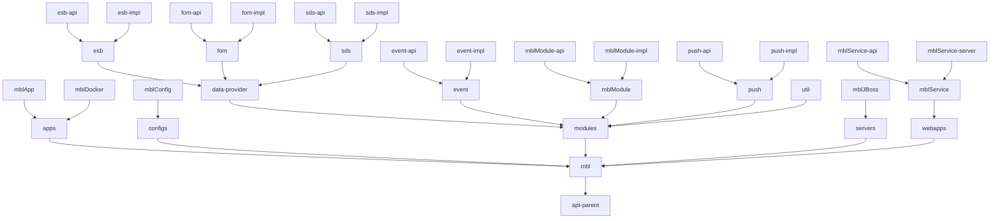

```mermaid
 graph TD
mbl --> apt-parent
apps --> mbl
mblApp --> apps
mblDocker --> apps
configs --> mbl
mblConfig --> configs
modules --> mbl
data-provider --> modules
esb --> data-provider
esb-api --> esb
esb-impl --> esb
fom --> data-provider
fom-api --> fom
fom-impl --> fom
sds --> data-provider
sds-api --> sds
sds-impl --> sds
event --> modules
event-api --> event
event-impl --> event
mblModule --> modules
mblModule-api --> mblModule
mblModule-impl --> mblModule
push --> modules
push-api --> push
push-impl --> push
util --> modules
servers --> mbl
mblJBoss --> servers
webapps --> mbl
mblService --> webapps
mblService-api --> mblService
mblService-server --> mblService
```